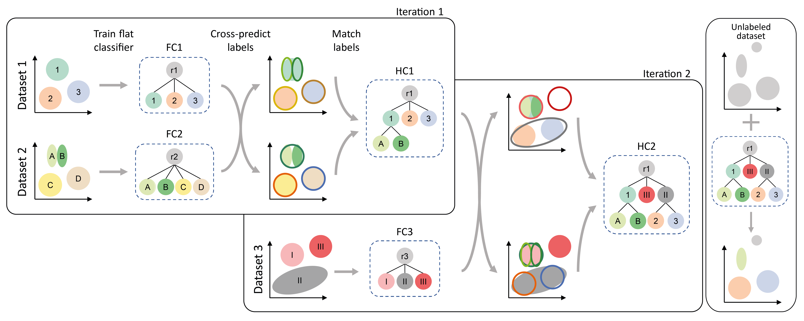

|PyPI| |Docs|

scHPL
=========================================================================

 
scHPL (single-cell Hierarchical Progressive Learning) is method that automatically finds relationships between cell populations across multiple datasets and uses this to construct a hierarchical classification tree. For each node in the tree either a linear SVM, kNN, or one-class SVM is trained. The trained classification tree can be used to predict the labels of a new unlabeled dataset.

.. note::
   scHPL is not a batch correction tool, we advise to align the datasets before matching the cell populations. We advise doing this with scVI or scArches. See the treeArches tutorials or the 'tips' tab for more information.

.. |PyPI| image:: https://img.shields.io/pypi/v/scHPL.svg
   :target: https://pypi.org/project/scHPL

.. |Docs| image:: https://readthedocs.org/projects/schpl/badge/?version=latest
   :target: https://schpl.readthedocs.io
